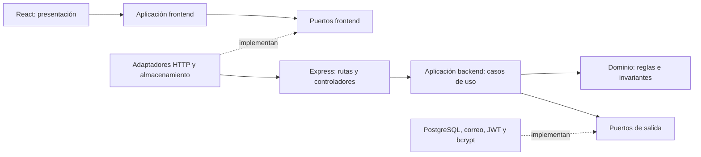

# Arquitectura hexagonal

El núcleo contiene reglas y casos de uso. No importa Express, PostgreSQL, bcrypt, JWT, Resend, React ni APIs de navegador. Los adaptadores implementan contratos estructurales de JavaScript y se conectan en `bootstrap`.



Las flechas representan dependencias o llamadas hacia contratos. El núcleo desconoce las implementaciones concretas. `bootstrap` es la excepción deliberada: conoce ambos lados para construir e inyectar las dependencias.

## Backend

```text
backend/
  server.js                         Entrada y arranque HTTP
  scripts/                          Adaptadores de entrada CLI
  src/
    domain/
      errors.js                     Errores de negocio sin códigos HTTP
      productInput.js, orderInput.js Validaciones de productos y pedidos
      commerceInput.js               Carrito, dirección e importes
      shopOrder.js                   Transiciones de pago, envío y permisos del gestor
      user.js, product.js, order.js  Conceptos y constantes
    application/
      ports/contracts.js            Contratos verificables de salida
      use-cases/                    Operaciones de negocio
    infrastructure/
      http/                         Express, DTOs, errores HTTP y middleware
      repositories/                 Persistencia PostgreSQL
      database/                     Conexiones, unidad de trabajo y migraciones
      services/                     Bcrypt, JWT, criptografía y Resend
      config/                       Traducción de variables de entorno
    bootstrap/
      createServices.js             Construye los casos de uso originales
      createCommerce.js             Construye los casos de uso del e-commerce
```

Los casos de uso reciben repositorios y servicios como argumentos. La interfaz del puerto pertenece a la aplicación; sus clases concretas pertenecen a infraestructura. No se necesitan interfaces TypeScript ni herencia para aplicar la inversión de dependencias en JavaScript.

Ejemplos:

- **Checkout:** valida datos, comprueba stock, calcula total y solicita operaciones al puerto de repositorio dentro de `UnitOfWork.run`. No conoce SQL ni conexiones.
- **Pagos y despacho:** `domain/shopOrder.js` decide qué transiciones son válidas; el caso de uso guarda el resultado y genera notificaciones. El adaptador PostgreSQL no decide si un pedido puede enviarse.
- **Aprobación de pedidos de proveedores y solicitudes de productos:** `resolveProviderOrder` y `resolveProductRequest` coordinan sus repositorios dentro de una unidad de trabajo. Los repositorios originales ya no ejecutan esas políticas.
- **Autenticación:** registro y login reciben `PasswordHasher`, `TokenService` y `UserRepository`. La verificación de vigencia de sesión es un caso de uso. Express se ocupa de extraer y verificar el token de la petición.
- **Recuperación:** la aplicación recibe puertos de reloj, criptografía y correo. Decide la caducidad y el uso único; PostgreSQL guarda los datos y Resend entrega el mensaje.
- **Errores:** el adaptador de persistencia traduce errores propios de PostgreSQL a códigos neutrales; la aplicación los interpreta y el adaptador HTTP los convierte en respuestas 400/401/403/404/409/503. No hay códigos `ER_*` ni `statusCode` en el núcleo.

La transacción es un puerto, no una conexión SQL entregada al caso de uso. El adaptador proporciona repositorios ligados a la misma conexión, confirma si el caso de uso termina correctamente y revierte si falla. Se conservan los bloqueos que protegen el stock y la idempotencia.

## Frontend

```text
frontend/src/
  main.jsx                    Entrada React
  presentation/               Pantallas, componentes y sus estilos
  domain/                     Reglas puras de carrito, imágenes e importes
  application/                Operaciones de tienda, portal y validación de imagen
  infrastructure/
    http/                     FetchGateway, ShopGateway, PortalGateway
    storage/                  BrowserStorage
    browser/                  BrowserImageLoader
  bootstrap/services.js       Conecta los adaptadores con la aplicación
```

Las pantallas llaman a `store` y `portal`: no construyen URLs de API, no usan fetch, no interpretan respuestas HTTP ni acceden directamente a localStorage/sessionStorage. El adaptador HTTP devuelve datos ordinarios. Los servicios de aplicación reciben almacenamiento, generador de identificadores e imagen por puertos; el carrito se puede probar sin navegador.

La presentación sí utiliza React y APIs propias de su responsabilidad, como scroll, navegación e impresión. Eso pertenece al adaptador de entrada y no introduce dependencias en el dominio. Los archivos `imageUrl.js` y `shopApi.js` de la raíz de src son fachadas de compatibilidad para utilidades y pruebas existentes; no contienen reglas ni acceso externo.

## Verificación y mantenimiento

```powershell
npm --prefix backend test
npm --prefix frontend test
npm --prefix frontend run lint
node deploy/build.mjs
```

Las pruebas de arquitectura revisan las importaciones y bloquean dependencias del núcleo hacia infraestructura o bootstrap. También comprueban que los adaptadores satisfacen los contratos de repositorio y que las pantallas no contienen acceso directo a HTTP o almacenamiento.

Las pruebas con puertos en memoria ejecutan compra, cancelación, reglas de envío, carrito e idempotencia sin servicios externos. Las de integración usan PostgreSQL y Express; ambas crean una base temporal y la eliminan al terminar. Se habilitan con PG_TEST_HOST, PG_TEST_PORT, PG_TEST_USER y PG_TEST_PASSWORD, sin leer backend/.env.

La migración a PostgreSQL conserva las URLs de API, roles y reglas de pago. Los esquemas SQL y los adaptadores ahora corresponden a PostgreSQL. El despliegue de AWS sigue usando tres paquetes de release, que deben regenerarse; los registros existentes en MySQL no se transfieren automáticamente.
